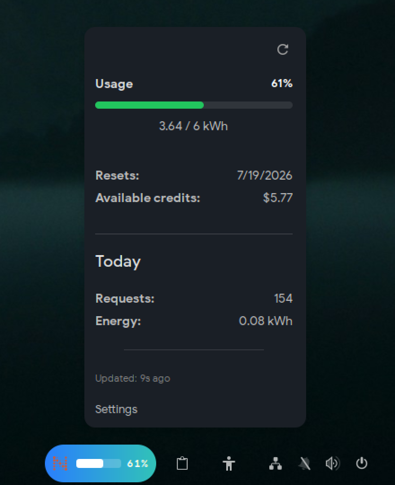

# Neuralwatt Usage Gnome Extension
   

A Gnome shell extension that displays your Neuralwatt usage and account stats in the top panel.



## Important Note                                                                                                                                                                                                
                                                                                                                                                                                                                   
I am not affiliated with Neuralwatt in any way, I just really needed a way to see my usage, and I use Gnome.... so....

## Features                                                                                                                                                                                                      
                                                                                                                                                                                                                   
- **Near-realtime** usage display
- **Account stats** including total usage for the subscription period, total usage for current day, and available credits
- **Configurable refresh rate** to adjust how often the usage is updated
- **Multiple accounts** support for users with multiple Neuralwatt accounts
                                                                                                                                                                                                            
## Requirements                                                                                                                                                                                                  
                                                                                                                                                                                                                   
- GNOME Shell 46 or later

## Installation                                                                                                                                                                                                  

Manual:

```bash
git clone https://github.com/nickgermaine/neuralwatt-usage-extension
cp -r neuralwatt-usage-extension ~/.local/share/gnome-shell/extensions/neuralwatt-usage-extension@nickgermaine.com 
cd ~/.local/share/gnome-shell/extensions/neuralwatt-usage-extension@nickgermaine.com/schemas                                                                                                                                        
glib-compile-schemas .

## Restart Gnome Shell by logging out and logging back in
## Then enable the extension
```
